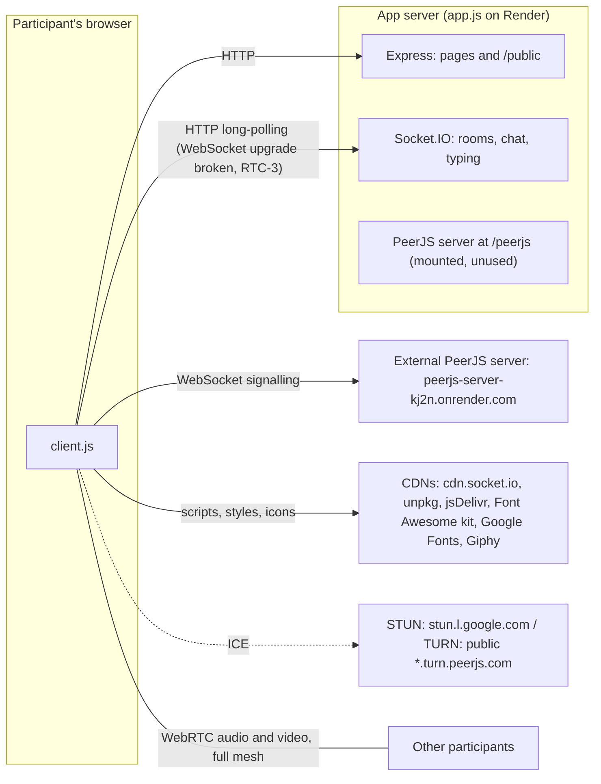
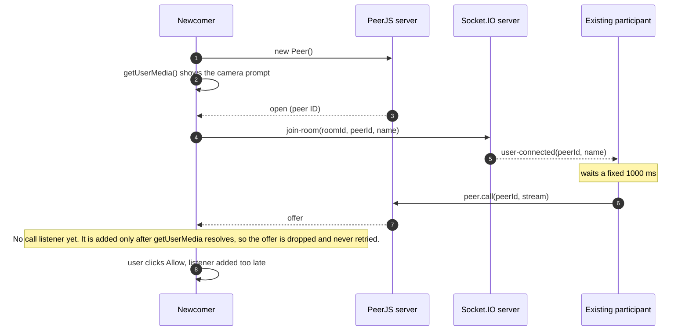
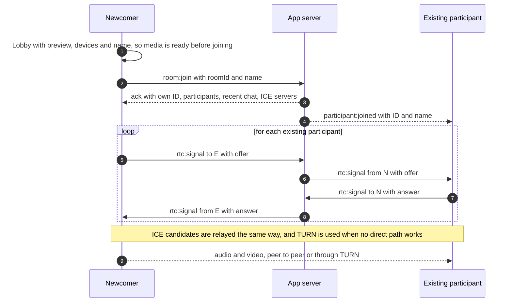

# VideoNChat: audit and implementation plan

**Status:** plan only. No application code was changed in this commit.
**Audited revision:** `bcb9fd4` on `main` (last commit 2025-01-07). **Audit date:** 2026-10-07.

## Contents

1. [Summary](#1-summary)
2. [How the app works today](#2-how-the-app-works-today)
3. [How the findings were verified](#3-how-the-findings-were-verified)
4. [Findings](#4-findings)
5. [Target architecture](#5-target-architecture)
6. [Roadmap](#6-roadmap)
7. [Quality bar](#7-quality-bar)
8. [Decisions for the owner](#8-decisions-for-the-owner)
- [Appendix A: Reproduction log](#appendix-a-reproduction-log)
- [Appendix B: Reference snippets for Phase 0](#appendix-b-reference-snippets-for-phase-0)
- [Appendix C: Dependency plan](#appendix-c-dependency-plan)

---

## 1. Summary

VideoNChat is a small Node.js meeting app: about 900 lines across `app.js`, `public/` and `views/`, built on Express, Socket.IO and PeerJS. Every URL is a meeting room with peer-to-peer video, text chat with a typing indicator, screen sharing, an invite link and a "ping" badge.

The happy path works. In local tests, three browsers in one room exchanged live audio and video, chat reached everyone, and a shared screen reached the people already in the call. Off that path, the audit found **44 issues**. **31** were reproduced, at least in part, by running the app; the rest come from code inspection. The ten that matter most:

| # | ID | Severity | Problem |
|---|---|---|---|
| 1 | SEC-1 | P0 | Chat messages are inserted as HTML. Any participant can run script in everyone's page, and that page already has camera and microphone permission. |
| 2 | RTC-1 | P0 | A newcomer who takes more than about a second to click "Allow" on the camera prompt never connects to anyone. First-time guests always see that prompt. |
| 3 | SEC-2 | P1 | Anyone with the link can join with no camera and an empty name, receive everyone's live audio and video, and never appear on screen. |
| 4 | RTC-3 | P1 | The bundled PeerJS server corrupts Socket.IO's WebSocket upgrade, so Socket.IO silently falls back to HTTP long-polling. |
| 5 | RTC-4 | P1 | On Firefox, Safari and every iOS browser, a TypeError aborts setup and the Leave button does nothing. |
| 6 | RTC-7 | P1 | One network blip permanently ends the call and the chat for that user. |
| 7 | RTC-6 | P1 | Tiles of people who left stay frozen on screen (still there after 45 s). |
| 8 | SEC-3, SEC-4, CHAT-1 | P1 | The server trusts every client message. That allows spoofed hang-ups, duplicated messages, 500 KB payloads and floods with no rate limit. |
| 9 | SRV-1, RTC-2 | P1 | `PORT` is ignored, and signalling depends on a second, hard-coded Render service. The app can't run locally without code edits. |
| 10 | SEC-5 | P1 | 22 known dependency vulnerabilities (1 critical, 14 high). `npm audit fix` clears 17 of them. |

Also high: no control can be reached by keyboard (UI-1); screen sharing fails for late joiners (RTC-8); and people without a working camera get a blank page (RTC-5).

**Roadmap at a glance** (one developer, rough estimates):

| Phase | Goal | Effort |
|---|---|---|
| 0. Hotfixes | Close the P0s and the cheap P1s with small diffs, no redesign | 2–3 days |
| 1. Safety net | Lint, server tests, multi-browser E2E tests with fake media, CI, Dependabot | 2–3 days |
| 2. Architecture and robustness | Modular server, validated protocol, native WebRTC signalling, reconnection, TURN, self-hosted assets, CSP | 2–3 weeks |
| 3. UX/UI and accessibility | Landing page and lobby, responsive grid, accessible controls, chat panel, mobile, design system | 2–3 weeks |
| 4. Features | Reactions, host controls, passcodes, recording, … | per feature |
| 5. Operate and scale | Deployment as code, observability, scaling, SFU path | 3–5 days, plus an SFU if needed |

**Already good:**
- The stack is small and readable.
- `/` generates UUID v4 room links, so default rooms can't be guessed.
- The Socket.IO script is pinned with SRI.
- The lockfile is committed.
- There is a mobile breakpoint.
- The core mesh design is sound: once the bugs below are fixed, it holds up well for small rooms.

---

## 2. How the app works today

### 2.1 Files

| File | Lines | Role |
|---|---|---|
| `app.js` | 72 | Express server: `/` redirects to a new UUID room, `/leave`, and `/:room` renders the room page. Socket.IO handles presence, chat and typing. A PeerJS server is mounted at `/peerjs`, but the client doesn't use it. |
| `public/client.js` | 399 | All room logic, nested inside the name prompt's `.then()`: PeerJS signalling to an external host, `getUserMedia`, mesh calls, mute/camera, screen share via `replaceTrack`, chat, the ping badge and leave |
| `views/room.ejs` | 103 | Room markup. Loads Socket.IO (CDN, with SRI), Font Awesome (a kit), PeerJS (unpkg) and SweetAlert2 (jsDelivr, `@11`); sets `ROOM_ID` in an inline script |
| `views/leave.ejs`, `public/leave.js` | 17 + 15 | Goodbye modal over an external GIF |
| `public/style.css` | 308 | Layout and theme |
| `tempCodeRunnerFile.js` | 1 | Editor artefact (contains the text `user-disconnected`) |

### 2.2 Runtime topology



- Rooms exist only as Socket.IO room names. The server keeps no other state.
- Media flows directly between browsers in a full mesh: every participant sends a separate stream to every other participant.
- Two signalling channels run side by side:
  - Socket.IO on the app server carries presence and chat.
  - PeerJS's WebSocket on a second Render service carries WebRTC offers, answers and ICE candidates.

### 2.3 Join sequence today, and where it breaks



---

## 3. How the findings were verified

- **Static review:** every file, plus the full git history (28 commits).
- **Dependency audit:** `npm audit` on the committed lockfile, then on a copy after `npm audit fix`.
- **Server probes:** the app ran locally on Node 22. It was probed with Socket.IO clients and with raw TCP upgrade requests.
- **Browser runs:** Playwright drove 2–4 headless Chromium users with fake camera and microphone (`--use-fake-ui-for-media-stream --use-fake-device-for-media-stream`) through the scenarios in [Appendix A](#appendix-a-reproduction-log).
- **Sandbox limits:**
  - The network policy blocked the production site and the CDNs, so production behaviour wasn't observed directly.
  - The harness served the same library files from npm instead. The `socket.io-client` 4.7.5 file matched the page's SRI hash byte for byte. PeerJS was 1.5.4, and SweetAlert2 was 11.26.25, which is what `@11` resolves to today.
  - Font Awesome, Google Fonts and Giphy were stubbed out; no logic depends on them.
  - The hard-coded PeerJS host was pointed at the app's own `/peerjs` server. That was the only change to app behaviour.
- **Simulations:**
  - Firefox and Safari behaviour: emulated by removing `navigator.connection` in Chromium. Real Firefox and WebKit runs are part of Phase 1.
  - A slow permission prompt: `getUserMedia` wrapped in a 4 s delay.
  - A network blip: `socket.io.engine.close()`.

**Severity scale:**
- **P0, critical:** a security hole, or a core feature broken for many users. Fix now.
- **P1, high:** serious malfunction or risk. Fix in the next iteration.
- **P2, medium:** a noticeable defect or gap. Schedule it.
- **P3, low:** polish and hygiene.

**How each finding is written up:**
- **Where:** the location, as `file:line` at `bcb9fd4`.
- **Impact:** what goes wrong for users or the operator.
- **Evidence:** "Reproduced" means it was observed with the app running. "Code inspection" means it was read, not executed.
- **Fix:** the fix, and the phase it's planned for.

---

## 4. Findings

### 4.1 Security and privacy

#### SEC-1 · P0 · Chat messages and typing notices are inserted as HTML (XSS)

- **Where:**
  - `public/client.js:305-320`: ``messages.innerHTML = messages.innerHTML + `…${message}…${userName}…` ``.
  - `public/client.js:275`: the typing notice.
  - The server relays the text unchanged (`app.js:52-55`).
- **Impact:** any participant can run JavaScript in every participant's page, their own included. That page already has camera and microphone permission. Injected code can silently reopen both and send the stream elsewhere, rewrite the page, or redirect to a phishing site. And because each message rebuilds the whole history with `innerHTML +=`, every earlier message is re-parsed. The cost grows quadratically, and injected handlers fire again each time.
- **Evidence:** Reproduced. Typing `` into the normal chat box ran the script in both browsers.
- **Fix:**
  - Phase 0: build message nodes with `textContent` and append them ([B4](#b4-render-chat-without-html-sec-1)). On the server, accept only strings, trim them and cap their length ([B6](#b6-server-socket-handlers-chat-1-sec-3-sec-4-chat-3)).
  - Phase 2: add a strict CSP (`script-src 'self'`) as defence in depth, plus the `no-unsanitized` ESLint rule to stop dynamic data reaching `innerHTML`.
  - SweetAlert2's `text` option is rendered as text, so the join toast is safe. `title` and `html` are not, so keep user data out of them.

#### SEC-2 · P1 · Anyone with the link can watch and listen without appearing

- **Where:**
  - `public/client.js:58-60` answers every incoming call.
  - `public/client.js:74-85` calls every newcomer.
  - `app.js:47-50` accepts any `join-room`.
- **Impact:**
  - Knowing the URL is the only thing that admits someone to a room, and a joiner doesn't have to be visible.
  - When anyone joins, every existing participant automatically sends them their camera and microphone.
  - A joiner who answers without media gets no tile, and there's no participant list. Their name can be empty and shows only in a 1.5-second toast.
  - Rooms with readable names (`/standup`) can also be guessed.
- **Evidence:** Reproduced. A script that never loaded the room UI joined with an empty name and no devices. It received live audio and video from both participants, whose screens kept showing only each other. Separately, a plain Socket.IO client that never loaded the page received all chat messages.
- **Fix:**
  - Phase 2: the server owns membership. Everyone who joins appears in the participant list and gets a tile, with an avatar if there's no video. Names are required and validated on the server, and signalling is relayed only between members.
  - Phase 4: optional passcode, waiting room, and a host "remove participant" control.
  - Until then, share only the generated UUID links.

#### SEC-3 · P1 · The server trusts client-supplied identity

- **Where:** `app.js:47-50`, `app.js:67-70`.
- **Impact:** `join-room` accepts any PeerJS ID and any name. A client can claim another participant's peer ID. When the impostor then disconnects, the server announces the *victim* as gone, and everyone hangs up on them.
- **Evidence:** Reproduced. An impostor joined with an existing participant's peer ID. The others received `user-connected`, then `user-disconnected`, for the victim's ID.
- **Fix:**
  - Phase 0: keep per-socket state on the server. Accept a peer ID that is already in the room only with the same per-tab secret ([B6](#b6-server-socket-handlers-chat-1-sec-3-sec-4-chat-3)).
  - Phase 2: participant IDs are issued by the server and stamped as `from` on everything it relays.

#### SEC-4 · P1 · Socket events have no validation, size limit or rate limit

- **Where:** `app.js:47-65`.
- **Impact:** payloads of any type and size, up to Socket.IO's 1 MB default, are relayed to the whole room at any rate. A single client can flood every participant's chat, memory and bandwidth.
- **Evidence:** Reproduced.
  - An object payload and a 500,000-character string were both relayed verbatim.
  - 500 back-to-back `typing` events were all relayed (1,000 with the stacked handlers from CHAT-1).
- **Fix:**
  - Phase 0: type and length checks, and `maxHttpBufferSize: 64 * 1024`.
  - Phase 2: a schema per event, a token-bucket rate limit per socket, and a room size cap.

#### SEC-5 · P1 · 22 known vulnerabilities in dependencies

- **Where:** `package-lock.json`.
- **Impact:** `npm audit` reports 1 critical (`proxy-addr`), 14 high, 4 moderate and 3 low. Several are memory-exhaustion and DoS issues in the internet-facing realtime stack (`socket.io-parser`, `engine.io`, `ws`), so any visitor can reach them. The critical `proxy-addr` advisory isn't reachable today, because `trust proxy` isn't set.
- **Evidence:** Reproduced. `npm audit fix` (no breaking changes; it brings in `express@4.22.3` and `socket.io@4.8.4`) leaves 5:
  - the dev-only `nodemon` chain (`braces`, `chokidar`, `minimatch`);
  - `uuid`, whose advisory concerns v3/v5/v6 called with a buffer argument. The app only uses v4.
- **Fix:**
  - Phase 0: run `npm audit fix`; replace `uuid` with `crypto.randomUUID()`; replace `nodemon` with `node --watch`.
  - Phase 1: Dependabot, plus `npm audit --omit=dev --audit-level=high` in CI.

#### SEC-6 · P2 · Any path becomes a room, and the room ID is injected into inline JavaScript

- **Where:** `app.js:38-40`; `views/room.ejs:16` (`const ROOM_ID = "<%= roomId %>";`).
- **Impact:**
  - `<%= %>` applies HTML escaping, which is the wrong escaping inside `<script>`. A `\` or a newline in the URL makes the page a syntax error, and the call never starts.
  - Characters like `"` reach the script as entities (`&#34;`), so the client's room ID no longer matches the URL.
  - The inline script also blocks a strict CSP.
- **Evidence:** Reproduced. `/%5C` renders `const ROOM_ID = "\";`, and `/a%0Ab` renders a raw line break inside the string. `/a"b</script>` can't break out of the script, but arrives as `a&#34;b&lt;/script&gt;`.
- **Fix:** validate the route parameter against the format the app generates, and return 404 otherwise. Pass the ID through a `data-room-id` attribute, or read it from `location.pathname`, so there's no inline script.

#### SEC-7 · P2 · CORS allows any origin with credentials

- **Where:** `app.js:12-18`.
- **Impact:** every Socket.IO response, including the WebSocket 101, carries `Access-Control-Allow-Origin: *` together with `Access-Control-Allow-Credentials: true`. The page is same-origin, so none of this is needed, and it invites any website to script the realtime API. WebSocket connections aren't subject to CORS at all, so the origin has to be checked on the server anyway.
- **Evidence:** Reproduced (response headers).
- **Fix:** remove the `cors` block. In Phase 2, check `Origin` against the configured public URL in Socket.IO's `allowRequest`.

#### SEC-8 · P2 · No security headers

- **Where:** `app.js` has no security middleware.
- **Impact:**
  - There's no Content-Security-Policy, HSTS, `X-Content-Type-Options` or `Referrer-Policy`.
  - There's no `frame-ancestors`, so another site can frame the meeting UI and trick users into clicking "Share screen".
  - There's no `Permissions-Policy` for camera, microphone or display capture.
  - `X-Powered-By: Express` is advertised.
- **Evidence:** Reproduced (response headers).
- **Fix:** Phase 2: `helmet` with a strict CSP once the inline script and the CDNs are gone, plus `Permissions-Policy: camera=(self), microphone=(self), display-capture=(self)`.

#### SEC-9 · P2 · Third-party scripts: floating versions, no integrity, single points of failure

- **Where:** `views/room.ejs:9-13`, `views/leave.ejs:8`, `public/style.css:1`.
- **Impact:**
  - SweetAlert2 loads as `sweetalert2@11`, so every new 11.x release runs unreviewed. It's also loaded over a protocol-relative URL (`//cdn.jsdelivr.net/…`), which becomes plain `http://` on an http page.
  - PeerJS comes from unpkg without SRI.
  - Font Awesome is a personal "kit" script, which can't be pinned with SRI. If the kit is removed or restricted, every icon disappears. The controls are icon-only, so the meeting becomes unusable.
  - Google Fonts is pulled in through a render-blocking `@import`, and the font isn't even applied (UI-5).
  - Only the Socket.IO script has SRI.
- **Evidence:** Reproduced for the protocol-relative URL (observed in the harness). The rest is from code inspection.
- **Fix:**
  - Phase 0 stopgap: pin exact versions and add SRI hashes.
  - Phase 2: bundle everything from npm, serve it same-origin, and use inline SVG icons.

#### SEC-10 · P2 · Privacy: chat content in server logs, plus a third-party GIF

- **Where:** `app.js:45, 48, 53, 58, 63, 68`; `public/leave.js:11`.
- **Impact:** every chat message, name and typing event goes to stdout, and hosting platforms keep those logs. Participants don't expect the operator to keep their chat. The leave page also loads a GIF from `media.giphy.com`, which tells a third party about every visitor.
- **Evidence:** Code inspection.
- **Fix:**
  - Phase 0: stop logging content.
  - Phase 2: structured logs with IDs and counts only.
  - Phase 3: local assets only.

### 4.2 Calling and media (WebRTC)

#### RTC-1 · P0 · Newcomers who are slow to allow the camera never connect

- **Where:** `public/client.js:49-91`, `74-85`, `110-113`.
- **Impact:**
  - The newcomer emits `join-room` as soon as its PeerJS connection opens.
  - At that point `getUserMedia` hasn't resolved yet. `peer.on("call")` isn't registered yet either, because that line sits inside the `getUserMedia` `.then`.
  - Existing participants call the newcomer after a fixed `setTimeout(…, 1000)`.
  - If the camera prompt is still open at that moment, the call arrives with no listener and is lost. Nothing retries.
  - Every first-time visitor sees that prompt.
- **Evidence:** Reproduced. With `getUserMedia` delayed by 4 s (a person reading the prompt), neither side ever showed the other: 1 tile each instead of 2.
- **Fix:**
  - Phase 0: register `peer.on("call")` immediately, and answer once local media has settled. Emit `join-room` only after the peer is open and media has settled, and delete the timer ([B5](#b5-reliable-join-and-call-tracking-rtc-1-rtc-5-rtc-6-rtc-7)).
  - Phase 2: the newcomer starts connections to the participant list returned with the join acknowledgement, with no timers.

#### RTC-2 · P1 · Signalling depends on a separate, hard-coded PeerJS deployment

- **Where:** `public/client.js:36-42` (`host: "peerjs-server-kj2n.onrender.com"`). `app.js:20-26` already mounts a PeerJS server at `/peerjs` that nothing uses.
- **Impact:**
  - **Two cold starts:** two free-tier Render services each spin down after 15 minutes idle and take up to about a minute to wake. A call can't start until both are awake.
  - **External dependency:** every call depends on a service that isn't in this repository.
  - **Local development:** the app can't run locally without editing code. On `http://localhost`, PeerJS sets `secure: false` but keeps its default port 443, so it tries `ws://peerjs-server-kj2n.onrender.com:443` (`isSecure()` and `CLOUD_PORT` in the PeerJS 1.5.4 source).
  - **Config churn:** 18 of the 28 commits ("Updated host", "Updated port", …) hand-edit this configuration.
- **Evidence:** the browser tests used the built-in `/peerjs` server with a same-origin config, and 2- and 3-person calls connected normally. The local-dev failure comes from inspecting the PeerJS source.
- **Fix:**
  - Phase 0: same-origin PeerJS configuration ([B3](#b3-same-origin-peerjs-client-rtc-2)) plus the RTC-3 fix ([B2](#b2-let-peerjs-and-socketio-share-the-http-server-rtc-3)). Retire the external service after deploying.
  - Phase 2: remove PeerJS entirely ([5.2](#52-signalling-decision-proposed-adr-001)).

#### RTC-3 · P1 · The bundled PeerJS server breaks Socket.IO's WebSocket transport

- **Where:** `app.js:12`, `app.js:21-26`.
- **Impact:**
  - PeerJS attaches a `ws` WebSocket server to the same HTTP server, with a path filter.
  - `ws` answers every upgrade for any other path with `400 Bad Request`. By then, Engine.IO has already accepted Socket.IO's upgrade on that socket.
  - The 400 is written into the live WebSocket, so the client sees a corrupt frame.
  - Socket.IO then stays on HTTP long-polling for the whole session: more latency, more requests and more server load.
  - This also happens in production, even though the client never uses this PeerJS server.
- **Evidence:** Reproduced.
  - A raw upgrade to `/socket.io/?EIO=4&transport=websocket` returned `HTTP/1.1 101 Switching Protocols … HTTP/1.1 400 Bad Request` on the same socket.
  - A Node client failed with `Invalid WebSocket frame: RSV1 must be clear`.
  - Chromium logged `WebSocket connection … failed: Invalid frame header`.
  - `socket.io.engine.transport.name` stayed `polling`.
- **Fix:**
  - Use PeerJS's `createWebSocketServer` option with `noServer: true`, so it only handles its own path ([B2](#b2-let-peerjs-and-socketio-share-the-http-server-rtc-3)). Verified in a scratch copy with Express 4.22 and 5.2: Socket.IO upgraded to WebSocket, and PeerJS signalling still answered `{"type":"OPEN"}`.
  - Removing PeerJS in Phase 2 removes the issue for good.

#### RTC-4 · P1 · Firefox, Safari and all iOS browsers: setup crashes and Leave does nothing

- **Where:** `public/client.js:358-377`, `381-397`.
- **Impact:** `navigator.connection` (the Network Information API) exists only in Chromium-based browsers. Everywhere else, `navigator.connection.rtt` throws a TypeError. It runs synchronously inside the setup callback, so nothing after it runs, including the code that wires up the Leave button. Every iOS browser uses WebKit, so every iPhone and iPad user is affected.
- **Evidence:** Reproduced by removing `navigator.connection` in Chromium: `Cannot read properties of undefined (reading 'rtt')`. Clicking Leave then showed no dialog.
- **Fix:** Phase 0: feed the badge from a real round-trip measurement over Socket.IO, which works in every browser ([B8](#b8-real-round-trip-time-rtc-4-ui-4)). This also fixes UI-4.

#### RTC-5 · P1 · No camera, or permission denied, gives a silent dead end

- **Where:** `public/client.js:49-91` (no `.catch`), `129`, `170`.
- **Impact:**
  - Audio and video are requested together. If the user denies permission, has no webcam, or has the camera busy in another app, the promise rejects and nothing tells them.
  - The call handler is registered only on success, so they can't even watch or listen to others.
  - The mute and camera buttons throw.
  - Nobody else ever sees them.
- **Evidence:** Reproduced. `NotAllowedError` and `NotFoundError` both gave no message and 0 tiles. Clicking mute then threw `Cannot read properties of undefined (reading 'getAudioTracks')`.
- **Fix:**
  - Phase 0: on failure, retry audio-only, then fall back to watch-only. Show a clear message with a "Try again" button, and still answer calls ([B5](#b5-reliable-join-and-call-tracking-rtc-1-rtc-5-rtc-6-rtc-7)).
    - With PeerJS, a watch-only participant can't place calls. They only see people who were already in the room when they joined.
    - Phase 2's `recvonly` transceivers remove that limit.
  - Phase 3: a lobby with device checks and specific guidance for each error.

#### RTC-6 · P1 · People who leave stay on screen as frozen tiles

- **Where:** `public/client.js:58-72` (answered calls are never stored), `95-108` (only outgoing calls are stored in `peers`), and `87-90`.
- **Impact:** only the side that placed a call can close it when `user-disconnected` arrives. On the answering side, the tile of someone who left stays on its last frame, and its tracks still report `live`.
- **Evidence:** Reproduced with 3 users. After the first joiner left, the person she had called still showed her tile 45 s later, when the test stopped waiting. In the other direction, the tile was removed within 3 s.
- **Fix:** keep one map of calls keyed by remote peer, for both directions. Remove the tile on `user-disconnected`, `close`, `error` and ICE failure ([B5](#b5-reliable-join-and-call-tracking-rtc-1-rtc-5-rtc-6-rtc-7)).

#### RTC-7 · P1 · One network blip permanently drops the call and the chat

- **Where:** `app.js:67-70`. The client has no `connect`/`disconnect` handling and no `peer.on("disconnected" | "error")`.
- **Impact:**
  - The Socket.IO connection drops (a Wi-Fi hiccup, a laptop sleeping, a phone switching networks) and reconnects as a new socket. That new socket is never put back in the room.
  - Meanwhile the server announces `user-disconnected` for the old socket, so everyone hangs up the media too.
  - The user silently stops receiving chat, and video ends on both sides. Nothing re-establishes either.
- **Evidence:** Reproduced. One forced transport close produced a new socket ID and no further chat. Both participants went from 2 tiles to 1.
- **Fix:**
  - Phase 0: re-emit `join-room` on reconnect. [B5](#b5-reliable-join-and-call-tracking-rtc-1-rtc-5-rtc-6-rtc-7) and [B6](#b6-server-socket-handlers-chat-1-sec-3-sec-4-chat-3) make that safe.
  - Phase 2:
    - a participant session that survives reconnects;
    - a 10–15 s grace period before announcing a departure;
    - Socket.IO `connectionStateRecovery`;
    - ICE restart on failure.
  - Media is peer-to-peer, so with these in place a call can even survive a server deploy.

#### RTC-8 · P1 · Screen sharing misbehaves in several ways

- **Where:** `public/client.js:227-260`.
- **Impact and evidence:**
  - The sharer's own tile keeps showing the camera, so there's no preview of what is being shared. Reproduced.
  - `currentPeer` keeps every RTCPeerConnection ever opened. After anyone leaves, `replaceTrack` on the closed connection throws an unhandled `InvalidStateError`. Reproduced.
    - A sender whose track is `null` would throw inside the loop and skip the remaining peers. Code inspection.
  - Anyone who joins during a share gets the camera, not the screen. Reproduced.
  - Clicking Share again starts a second capture and leaks the first: both tracks stayed `live`. Reproduced.
  - There's no in-app "Stop sharing" and no button state. `stopScreenShare` runs only when the browser's own stop control ends the track. Code inspection.
  - There's no support check, so on browsers without `getDisplayMedia` (most mobile browsers) the button only logs an error. Code inspection.
- **Fix:** Phase 2: a screen-share controller ([task 2.6](#phase-2-architecture-and-robustness-23-weeks)).

#### RTC-9 · P1 · iPhone and iPad: videos lack `playsinline`

- **Where:** `public/client.js:115-122`.
- **Impact:** without `playsinline`, WebKit on iPhone plays video in its fullscreen player instead of inside the grid. Rejected `video.play()` calls (autoplay policy) are also ignored.
- **Evidence:** Code inspection. To be confirmed on a device in Phase 1.
- **Fix:**
  - Phase 0: `video.playsInline = true; video.autoplay = true;`.
  - Phase 2: when `play()` is rejected, show a "Tap to enable audio" prompt.

#### RTC-10 · P1 · No TURN server of our own

- **Where:** `public/client.js:36-42` passes no `config`.
- **Impact:**
  - PeerJS 1.5.4 falls back to Google STUN plus PeerJS's free public TURN servers: `turn:eu-0.turn.peerjs.com:3478` and `turn:us-0.turn.peerjs.com:3478`, with shared credentials.
  - Those servers are shared and best-effort, with no SLA.
  - They don't offer `turns:` on port 443, which is often the only thing that gets through strict corporate or campus firewalls.
  - When they're down, people behind symmetric NAT can't connect.
- **Evidence:** the PeerJS 1.5.4 source (`DEFAULT_CONFIG`).
- **Fix:** Phase 2: a TURN service we control, either managed (e.g. Cloudflare or Twilio) or self-hosted coturn, including `turns:` on 443. The server hands out short-lived credentials from `/api/ice-servers`.

#### RTC-11 · P2 · You can't tell who is who, or who is muted

- **Where:** `public/client.js:115-122`, `126-204`.
- **Impact:**
  - Tiles have no names.
  - Muting or turning the camera off isn't signalled, so others just see black or frozen video.
  - There's no speaking indicator and no participant list.
- **Evidence:** Reproduced. The grid contains only bare `<video>` elements.
- **Fix:**
  - Phase 2: a `media:state` event.
  - Phase 3: tiles with a name; mic, camera and screen indicators; initials when the camera is off; a speaking highlight.

#### RTC-12 · P2 · Video element defects

- **Where:** `public/client.js:115-122`; `public/style.css:135-137`.
- **Impact:**
  - Every video has native `controls`. People can unmute their own preview (and hear themselves) or pause someone else's feed, and every video becomes a Tab stop.
  - The self-view isn't mirrored.
  - PeerJS fires `stream` once per track, so `addVideoStream` runs twice per call and stacks listeners.
- **Evidence:** Reproduced (`controls: true` on every video). The duplicate `stream` events come from inspecting PeerJS's `ontrack` handling.
- **Fix:** no native controls; mirror the self-view with CSS; create tiles idempotently, keyed by participant.

#### RTC-13 · P2 · Full mesh with no limits

- **Where:** `public/client.js:49-53`, `95-108`.
- **Impact:**
  - Each participant encodes and uploads a separate stream to each of the others (N−1 uploads). On typical home upload bandwidth, quality collapses beyond 4–6 people.
  - There's no room cap.
  - `video: true` takes whatever the browser picks by default.
  - Nothing adapts bitrate or resolution as the room grows.
- **Evidence:** Code inspection.
- **Fix:**
  - Phase 2:
    - a configurable room cap (default 6);
    - explicit capture constraints, e.g. 640×360 at 24–30 fps with echo cancellation, noise suppression and auto gain on;
    - lower `maxBitrate`/`scaleResolutionDownBy` through `RTCRtpSender.setParameters` as the room grows.
  - Phase 5: an SFU if larger rooms become a goal.

#### RTC-14 · P3 · Leaks and loose ends

- **Where:** `public/client.js:84`, `230`, `371-375`.
- **Details:**
  - `currentPeer` grows forever (see RTC-8).
  - `timerid` (`client.js:84`) is an implicit global.
  - The ping loop never stops and logs to the console every 5 s (`client.js:371-375`).
  - Screen sharing creates a `<video>` it never uses (`client.js:230`).
- **Evidence:** Code inspection.

### 4.3 Chat and presence

#### CHAT-1 · P1 · Each `join-room` stacks another set of server handlers

- **Where:** `app.js:47-71`.
- **Impact:** the `message`, `typing`, `stoppedTyping` and `disconnect` handlers are registered inside `join-room`. Each extra `join-room` on the same socket adds a full set, so one message gets broadcast N times. Any client can trigger this, and so would a naive reconnect fix.
- **Evidence:** Reproduced. After two `join-room` emits, one message arrived twice, and 500 `typing` events became 1,000.
- **Fix:** register handlers once per connection, keep the room and identity in `socket.data`, and ignore repeated joins ([B6](#b6-server-socket-handlers-chat-1-sec-3-sec-4-chat-3)).

#### CHAT-2 · P2 · Pressing Escape on the name prompt joins as "Null"

- **Where:** `public/client.js:11-30`.
- **Impact:**
  - SweetAlert2 closes on Escape by default. The code ignores `isDismissed` and uses `result.value`, which is `undefined` and gets sent as `null`.
  - Names made only of spaces, and names of any length, are accepted.
  - The name isn't remembered.
  - The server doesn't validate the name.
- **Evidence:** Reproduced. After one user pressed Escape, the other saw their messages from "Null".
- **Fix:**
  - Phase 0: set `allowEscapeKey: false` (or handle dismissal), trim, allow 1–40 characters, remember the name in `localStorage`, and validate it on the server.
  - Phase 3: the name moves into the lobby.

#### CHAT-3 · P2 · "Me" is decided by comparing names

- **Where:** `public/client.js:310`.
- **Impact:** two participants with the same name each see the other's messages labelled "Me".
- **Evidence:** Reproduced with two users named "Sam".
- **Fix:** the server sends the sender's ID with each message, and the client compares IDs ([B6](#b6-server-socket-handlers-chat-1-sec-3-sec-4-chat-3)).

#### CHAT-4 · P2 · The typing indicator is wrong and chatty

- **Where:** `public/client.js:273-280`, `291-301`.
- **Impact:**
  - It runs on `keydown`, before the input's value changes. The first character sends `stoppedTyping`, and after all the text is deleted, "is typing" stays.
  - It emits on every keystroke.
  - There is a single shared indicator, so anyone's message or `stoppedTyping` clears it for everybody.
  - It never expires if the typer leaves.
- **Evidence:** Reproduced. After one character, nothing was shown. After everything was deleted, "Bob is typing a message..." remained.
- **Fix:** use the `input` event; emit `typing` at most once every 2 s; expire it after about 3 s; track typers per person ("Ana and Bo are typing…") ([B7](#b7-typing-indicator-chat-4)).

#### CHAT-5 · P3 · Composer and history gaps

- **Where:** `public/client.js:281-326`.
- **Details:**
  - Whitespace-only messages are sent (reproduced).
  - There's no maximum length.
  - Pressing Enter during IME composition (Chinese or Japanese input) sends half-typed text.
  - Every new message yanks the reader to the bottom.
  - There's no unread badge while chat is hidden on mobile.
  - Late joiners see no history.
  - Timestamps come from the receiver's clock.
  - Links aren't clickable.
- **Fix:**
  - Phase 0: trim, cap the length, and ignore Enter while `isComposing`.
  - Phase 2: server timestamps and a short history.
  - Phase 3: the chat panel ([task 3.5](#phase-3-uxui-and-accessibility-23-weeks)).

### 4.4 Server, routing and operations

#### SRV-1 · P1 · The `PORT` environment variable is ignored

- **Where:** `app.js:6`: `const port = 3000 || process.env.PORT;`. This was a regression in commit `b98cb1e`, which swapped the operands.
- **Impact:** `3000 || anything` is always 3000.
  - Render copes, because it scans for whatever port the process opens.
  - Hosts that route only to `$PORT` (e.g. Heroku, Cloud Run) can't reach the app.
  - Two local instances can't run side by side.
- **Evidence:** Reproduced. `PORT=4567 node app.js` printed `Listening on port 3000..`.
- **Fix:** `const port = Number(process.env.PORT) || 3000;` ([B1](#b1-honour-port-srv-1)).

#### SRV-2 · P2 · Relative asset paths break on URLs with a trailing slash

- **Where:** `views/room.ejs:7` (`href="style.css"`), `views/room.ejs:102` (`src="client.js"`).
- **Impact:** `/<room>/` renders the page, but its assets resolve to `/<room>/style.css` and `/<room>/client.js`, which return 404. The result is an unstyled page that does nothing.
- **Evidence:** Reproduced. The page returned 200 and both assets returned 404.
- **Fix:** absolute paths (`/style.css`, `/client.js`), and optionally a redirect for trailing slashes.

#### SRV-3 · P2 · Leave goes to a hard-coded `http://` URL

- **Where:** `public/client.js:394`.
- **Impact:** `"http://" + host + "leave"` sends an HTTPS page to HTTP. It works only where the host redirects back, and it conflicts with HSTS.
- **Evidence:** Code inspection.
- **Fix:** stop the local tracks, then `location.assign("/leave")`.

#### SRV-4 · P3 · The room route catches everything

- **Where:** `app.js:38-40`.
- **Impact:** `/favicon.ico`, `/robots.txt` and `/apple-touch-icon.png` each render a full meeting page, and browsers request the favicon automatically. Unknown nested paths get Express's bare "Cannot GET" page.
- **Evidence:** Reproduced. `/favicon.ico` returned 200 `text/html` with `ROOM_ID = "favicon.ico"`.
- **Fix:** a validated room route (SEC-6), a real favicon, and branded 404 and 500 pages.

#### SRV-5 · P2 · Not production-ready yet

- **Where:** `app.js`.
- **Details:**
  - There's no health-check endpoint for the platform.
  - There's no `SIGTERM` handling, so deploys cut everyone off without warning.
  - Nothing is compressed: `client.js` (11.5 KB) is served raw (reproduced).
  - Static files are served with `Cache-Control: public, max-age=0` and no fingerprinting (reproduced).
  - There's no error handler and no 404 page.
  - Logging is ad-hoc `console.log`, including a "rooom" typo.
  - `debug: true` isn't a PeerJS server option, so passing it does nothing.
- **Fix:** Phase 2 ([task 2.1](#phase-2-architecture-and-robustness-23-weeks)).

### 4.5 UI, UX and accessibility

#### UI-1 · P1 · No control works with a keyboard or a screen reader

- **Where:** `views/room.ejs:29-98`.
- **Impact:**
  - All eight controls are `<div>`s with click handlers. They can't take focus, aren't announced as buttons, have no labels (they're icon-only) and have no pressed state.
  - The chat input has no label.
  - Chat messages and notifications aren't announced (no `aria-live`).
  - There are no focus styles.
  - axe-core also flags a missing `main` landmark, a missing `h1`, and content outside landmarks. axe can't tell that a `<div>` is meant to be a button, so it under-reports this page.
- **Evidence:** Reproduced. 0 of the 8 controls can take focus. Tab cycles only through the `<video>` elements (because of RTC-12) and the chat input.
- **Fix:**
  - Phase 0 quick win: `<button type="button" aria-label="…" aria-pressed="…">`.
  - Phase 3: a full keyboard and screen-reader pass ([task 3.12](#phase-3-uxui-and-accessibility-23-weeks)).

#### UI-2 · P2 · The layout doesn't adapt

- **Where:** `public/style.css:25-33`, `69-75`, `129-138`, `291-308`; `public/client.js:328-343`.
- **Impact:**
  - Tiles are a fixed 400×300, whatever the participant count or screen size.
  - The page height is `8vh + 92vh`, so on phones the browser's toolbars cover the controls.
  - Toggling chat on mobile writes inline styles that persist. Open chat in a narrow window, widen it, and the video area stays hidden.
- **Evidence:** Reproduced for the inline-style bug. The rest is from code inspection.
- **Fix:** Phase 3:
  - a CSS grid sized by participant count;
  - `aspect-ratio: 16 / 9` and `100dvh`;
  - panels driven by classes or state, not inline styles.

#### UI-3 · P2 · Branding leftovers and a dead-end leave page

- **Where:** `views/room.ejs:29-31` (`fab fa-microsoft`), `views/leave.ejs:7` (`<title>Teams Clone</title>`), `public/leave.js`.
- **Impact:** the header shows Microsoft's logo, which is a trademark problem and confusing. The leave page is titled "Teams Clone". It has no buttons and disables outside clicks, so there's no way to rejoin or start a new meeting. It also depends on an external GIF.
- **Evidence:** Code inspection.
- **Fix:** Phase 3: our own SVG logo, consistent "VideoNChat" naming, and a leave page with "Rejoin" and "New meeting" ([task 3.10](#phase-3-uxui-and-accessibility-23-weeks)).

#### UI-4 · P2 · The "ping" badge doesn't measure ping

- **Where:** `public/client.js:347-377`; `README.md:9`.
- **Impact:** `navigator.connection.rtt` is Chromium's rough estimate of recent network round-trip time, rounded to 25 ms. It is neither the round trip to this server nor the quality of the call. The README calls it the "Total round trip time from server to client".
- **Evidence:** Code inspection; see MDN, `NetworkInformation.rtt`.
- **Fix:**
  - Phase 0: a real round trip over Socket.IO ([B8](#b8-real-round-trip-time-rtc-4-ui-4)).
  - Phase 2: per-participant WebRTC `getStats()` (RTT, packet loss, jitter, bitrate) feeding a quality indicator.

#### UI-5 · P3 · CSS defects

- **Where:** `public/style.css:10-11`, `14-16`, `244`, `255`, plus duplicate rules at `65`/`278` and `172`/`286`.
- **Impact:**
  - `font-family: "Poppins,` is an unterminated string, so the declaration is dropped. The page renders in Times New Roman while still downloading Poppins through a render-blocking `@import`.
  - `margin: 1 rem 0` and `font-weight: 1500` are invalid.
  - `.swal-overlay` targets SweetAlert v1, which the app doesn't use.
  - There are duplicate rules.
- **Evidence:** Reproduced. The computed font was `"Times New Roman"`, and the `#feedback` margin was `0px`.
- **Fix:** stylelint in Phase 1, design tokens in Phase 3.

#### UI-6 · P3 · Interaction and markup polish

- **Where:** `public/client.js:126-223`; `views/room.ejs`, `views/leave.ejs`.
- **Details:**
  - Every mute or camera toggle pops up a SweetAlert.
  - The invite success message is a modal that has to be dismissed.
  - Invite uses the deprecated `document.execCommand("copy")`. It should use `navigator.clipboard.writeText()`, plus the Web Share API on phones.
  - The `<script>` tag sits after `</body>`.
  - There's no favicon, description or Open Graph metadata, so invite links unfurl poorly in WhatsApp or Slack.
  - `X-UA-Compatible` is obsolete.
- **Evidence:** Code inspection.

### 4.6 Code quality, tooling and documentation

#### DX-1 · P2 · One monolithic client script

- **Where:** `public/client.js`, `package.json`, `tempCodeRunnerFile.js`.
- **Details:**
  - All room logic is one 400-line closure inside the SweetAlert `.then()`.
  - It relies on globals (`user`, `ROOM_ID`), `var` and mixed styles.
  - There are typos: `claculateRTT`, `recurciveCalculate`, `Cammera`, `rooom`.
  - There's commented-out code and dead code:
    - the unused `<video>` in screen share;
    - the `socket.io-client` dependency, never used at runtime;
    - the `cors` block.
  - `tempCodeRunnerFile.js`, an editor artefact, is committed.
- **Evidence:** Code inspection.

#### DX-2 · P2 · No safety net

- **Where:** repository root.
- **Details:**
  - `npm test` exits with an error by design.
  - There's no linter, formatter, CI or Dependabot.
  - There's no `engines` field, `.nvmrc` or `.env.example`.
  - `.gitignore` doesn't cover `.env`, logs, coverage or test reports.
- **Evidence:** Code inspection.

#### DX-3 · P2 · Configuration is changed by editing source

- **Where:** git history.
- **Details:** 18 of the 28 commits, made over three days in July 2024, switch hosts and ports in code for different environments. Same-origin defaults and documented environment variables remove the need.
- **Evidence:** `git log`.

#### DX-4 · P3 · Documentation

- **Where:** `README.md`, `package.json`.
- **Details:**
  - The README has no setup steps, architecture, environment variables, browser support, limitations or troubleshooting.
  - There's no LICENSE file, although `package.json` says ISC.
  - The package description is "Building a Videochatapp.".
- **Evidence:** Code inspection.

---

## 5. Target architecture

### 5.1 Principles

1. **One origin.** The app serves its own pages, assets, Socket.IO and signalling. No CDNs, no second service.
2. **The server owns identity and membership.** It issues participant IDs, stamps `from` on everything it relays, and relays only within a room.
3. **Validate at the boundary.** Every socket payload is checked against a schema, size-limited and rate-limited.
4. **Media degrades step by step.** Camera and mic, then mic only, then watch-only. Every failure gets a clear message that says what to do.
5. **Recover, don't restart.** Socket reconnects, ICE restarts and grace periods keep calls alive through blips and deploys.
6. **Accessible and responsive by default.** Semantic controls, keyboard shortcuts and live regions, on everything from a 360 px phone to a desktop.
7. **Proven in CI.** Server integration tests and multi-browser E2E tests with fake media run on every pull request.

### 5.2 Signalling decision (proposed ADR-001)

| Option | Effort | For | Against |
|---|---|---|---|
| A. Keep PeerJS, with the Phase 0 fixes | Low | Smallest change | <ul><li>A second realtime channel and server package (`peer` 1.0.2; last stable release Dec 2023)</li><li>Identity split between socket IDs and peer IDs</li><li>`call()` needs a local stream, so watch-only users can't call</li><li>Little control over renegotiation and ICE restart</li></ul> |
| **B. Native `RTCPeerConnection`, signalled over the existing Socket.IO connection ("perfect negotiation")** | Medium (about 300 lines plus tests) | <ul><li>One channel</li><li>Identity stamped by the server</li><li>Watch-only users via `recvonly` transceivers</li><li>`restartIce()`</li><li>Two fewer dependencies</li><li>Full control</li></ul> | We own the negotiation code, and the E2E suite has to keep it honest |
| C. An SFU (LiveKit or mediasoup) | High | <ul><li>Scales well beyond 6 people</li><li>Simulcast</li><li>Recording</li></ul> | More infrastructure and cost; overkill for small rooms |

**Recommendation:**
- **Phase 0:** option A, to stop the bleeding with minimal change.
- **Phase 2:** option B.
- **Phase 5:** option C only if rooms larger than about 6 become a product goal.

### 5.3 Repository layout (target)

```text
.
├── src/
│   ├── server/
│   │   ├── index.js          # bootstrap: config → http → realtime; graceful shutdown
│   │   ├── config.js         # environment parsing, defaults, validation
│   │   ├── http.js           # Express: helmet/CSP, static files, routes, /healthz, 404
│   │   ├── realtime.js       # Socket.IO server, origin check, rate limits
│   │   ├── rooms.js          # in-memory room and participant registry
│   │   ├── handlers/         # room.js, chat.js, signal.js, media.js
│   │   ├── schemas.js        # payload validation
│   │   └── ice.js            # /api/ice-servers (short-lived TURN credentials)
│   └── client/
│       ├── index.html  room.html  leave.html
│       ├── main.js           # boot: lobby → join → room
│       ├── socket.js         # thin wrapper around the protocol
│       ├── rtc.js            # one RTCPeerConnection per participant (perfect negotiation)
│       ├── media.js          # devices, constraints, fallbacks, mute state
│       ├── screen-share.js
│       ├── stats.js          # getStats sampling, server RTT
│       ├── ui/               # tiles, controls, chat, participants, toasts, lobby
│       └── styles/           # tokens.css, base.css, layout.css, components.css
├── test/
│   ├── server/               # node:test + socket.io-client
│   └── e2e/                  # Playwright: Chromium, Firefox, WebKit
├── docs/
│   ├── protocol.md
│   └── adr/0001-signalling.md
├── .github/workflows/ci.yml, .github/dependabot.yml
├── eslint.config.js, .prettierrc, .stylelintrc.json, playwright.config.js, vite.config.js
├── .env.example, .nvmrc, LICENSE, README.md
└── package.json
```

### 5.4 Realtime protocol v1 (target)

Every client-to-server event is schema-validated and rate-limited. Every server-to-client event about another person carries the ID the server assigned to them.

| Event | Direction | Payload | Notes |
|---|---|---|---|
| `room:join` | C→S, with ack | `{ roomId, name, session? }` → `{ self, participants, history, iceServers }` | Validates the name, enforces capacity, resumes a session after a reconnect |
| `room:leave` | C→S | none | Also implied when a disconnect outlasts the grace period |
| `participant:joined` / `:left` / `:updated` | S→C | `{ id, name, audio, video, screen }` / `{ id }` | Feeds the tiles and the participant list |
| `media:state` | C→S | `{ audio, video, screen }` | Rebroadcast as `participant:updated` |
| `chat:send` | C→S, with ack | `{ text }`, 1–1000 characters after trimming | Rate-limited |
| `chat:message` | S→C | `{ id, from, name, text, ts }` | Server timestamp; the last 50 kept per room, in memory |
| `chat:typing` | C→S / S→C | `{ typing }` / `{ from, name, typing }` | Throttled; clients expire it after 4 s |
| `rtc:signal` | C→S→C | `{ to, description?, candidate? }` → `{ from, … }` | Relayed only between members of the same room |
| `net:ping` | C→S, with ack | none | Round-trip measurement |
| `server:restarting` | S→C | `{ inSeconds }` | Sent on `SIGTERM`; clients show "Reconnecting…" |

### 5.5 Join flow (target)



---

## 6. Roadmap

Effort figures assume one developer and are rough. Task IDs refer to the findings in Section 4.

### Phase 0: Hotfixes (2–3 days)

Goal: close the P0s and the cheap P1s with small, low-risk changes to the existing files, with no redesign. Snippets are in [Appendix B](#appendix-b-reference-snippets-for-phase-0).

**0.1 Render chat safely** (SEC-1, CHAT-5)
- [ ] Build chat messages and the typing notice from DOM nodes with `textContent`, and append them (B4). Never pass remote data to `innerHTML`.
- [ ] On the server, accept only strings, trim them, limit them to 1,000 characters, and drop empty messages (B6).

**0.2 Make joining reliable** (RTC-1, RTC-5, RTC-6)
- [ ] Register `peer.on("call")` immediately, and answer once local media has settled (B5).
- [ ] Emit `join-room` only once the peer is open and media has settled. Remove the 1-second `setTimeout`.
- [ ] Media fallback: camera and mic, then mic only, then watch-only, with a visible message and a "Try again" button.
- [ ] One `calls` map for both directions. Remove tiles on `user-disconnected`, `close` and `error`.

**0.3 Same-origin signalling** (RTC-2, RTC-3, SRV-1)
- [ ] `const port = Number(process.env.PORT) || 3000;` (B1).
- [ ] Route only PeerJS's own WebSocket path to PeerJS (B2), and add `ws` as a direct dependency.
- [ ] Point the client at `/peerjs` on the same origin (B3).
- [ ] After deploying, check DevTools → Network → WS: Socket.IO should be using `websocket`. Then retire the external PeerJS service.

**0.4 Harden the server's socket handlers** (CHAT-1, SEC-3, SEC-4, SEC-7, SEC-10, CHAT-3)
- [ ] Register handlers once per connection. Keep `{ roomId, peerId, name, secret }` in `socket.data`, and ignore repeated joins (B6).
- [ ] Validate the room ID, the peer ID and the name (1–40 characters).
- [ ] Accept a peer ID that's already in the room only with the same per-tab secret, and then replace the stale socket.
- [ ] Include the sender's peer ID in `createMessage`, so the client decides "Me" by ID.
- [ ] Set `maxHttpBufferSize: 64 * 1024`, remove the `cors` block, and stop logging names and message bodies.

**0.5 Cross-browser and resilience fixes** (RTC-4, RTC-7, RTC-9, RTC-12, CHAT-2, CHAT-4, SRV-3, UI-4)
- [ ] Feed the ping badge from a Socket.IO round trip instead of `navigator.connection` (B8).
- [ ] Re-emit `join-room` after every reconnect.
- [ ] Name prompt: disable Escape (or handle dismissal), trim, cap the length, and remember the name in `localStorage`.
- [ ] Drive the typing indicator from the `input` event, throttled and auto-expiring (B7). Ignore Enter while `isComposing`.
- [ ] Leave: stop the local tracks, then `location.assign("/leave")`.
- [ ] Videos: `playsInline` and `autoplay`, no `controls`, and a mirrored self-view in CSS.

**0.6 Dependencies and hygiene** (SEC-5, SEC-9, SRV-2, DX-1)
- [ ] Run `npm audit fix`, which brings in `express@4.22.3` and `socket.io@4.8.4`, then re-test.
- [ ] Replace `uuid` with `crypto.randomUUID()`.
- [ ] Replace `nodemon` with a `"dev": "node --watch app.js"` script.
- [ ] Move `socket.io-client` to devDependencies; it's for tests.
- [ ] Load the Socket.IO client from the app itself (`/socket.io/socket.io.min.js`), so it always matches the server.
- [ ] Pin exact SweetAlert2 and PeerJS versions with SRI hashes. This is a stopgap until Phase 2.
- [ ] Use absolute asset paths (`/style.css`, `/client.js`).
- [ ] Delete `tempCodeRunnerFile.js` and extend `.gitignore`.

**0.7 Quick accessibility win** (UI-1, partial)
- [ ] Turn the controls into `<button type="button">` elements with `aria-label`, plus `aria-pressed` on toggles. Reset the button styles in CSS.

**Suggested PRs, in order:**
1. 0.1
2. 0.3
3. 0.4
4. 0.2 and 0.5
5. 0.6
6. 0.7

Each is small enough to review in one sitting.

**Done when** (checked by hand with the [Appendix A](#appendix-a-reproduction-log) scenarios, then automated in Phase 1):
- The XSS payload shows up as plain text.
- A newcomer who takes 4 s to allow the camera still connects, with 2 tiles on each side.
- Firefox and Safari show no console errors, and Leave works.
- Socket.IO's transport is `websocket`.
- `PORT=4567 npm start` listens on 4567, and the app runs locally with no code edits.
- Denying the camera shows a message, and the user can still see and hear people already in the room.
- When someone leaves, their tile disappears from every screen within about 2 s.
- After a forced transport close, chat and video come back without user action.
- `npm audit --omit=dev` reports no high or critical issues.

### Phase 1: Safety net (2–3 days)

Goal: every Phase 0 bug gets a regression test, and CI blocks any merge that brings one back.

**1.1 Tooling**
- [ ] ESLint (flat config): `eslint:recommended`, browser and Node globals, and `eslint-plugin-no-unsanitized`.
- [ ] Prettier.
- [ ] stylelint with `stylelint-config-standard`, which would have caught UI-5.
- [ ] EditorConfig.
- [ ] npm scripts: `dev`, `start`, `lint`, `format`, `test`, `test:e2e`.

**1.2 Server integration tests**
- [ ] `node:test` with `socket.io-client`, covering:
  - the join and leave lifecycle;
  - idempotent repeated joins;
  - payload validation and limits;
  - peer-ID ownership (the per-tab secret);
  - re-joining after a reconnect;
  - no message content in the logs.

**1.3 End-to-end tests**
- [ ] `@playwright/test`, with these projects:
  - Chromium, with `--use-fake-ui-for-media-stream --use-fake-device-for-media-stream`;
  - Firefox, with the prefs `media.navigator.streams.fake` and `media.navigator.permission.disabled`;
  - WebKit, for UI smoke tests.
- [ ] `webServer` starts the app for the run.
- [ ] Scenarios, based on Appendix A:
  - 2- and 3-person calls;
  - the XSS payload stays inert;
  - a slow camera permission;
  - a denied or missing camera;
  - cleanup on leave;
  - a transport drop;
  - a screen share, including to a late joiner;
  - keyboard-only use;
  - an axe-core scan.

**1.4 CI and dependency updates**
- [ ] A GitHub Actions workflow on every push and pull request:
  - `npm ci`, then lint, unit tests, E2E tests and `npm audit --omit=dev --audit-level=high`;
  - upload the Playwright trace when E2E fails;
  - run on Node 22 and 24.
- [ ] Dependabot for npm and GitHub Actions, weekly and grouped.
- [ ] Optionally, CodeQL.
- [ ] Branch protection on `main`, requiring CI to pass.

**1.5 Repository basics**
- [ ] `engines.node` in `package.json`.
- [ ] `.nvmrc`.
- [ ] `.env.example`, listing every variable.
- [ ] A `LICENSE` file.

**Done when:** CI is green on `main`, and reverting any Phase 0 fix makes it fail.

### Phase 2: Architecture and robustness (2–3 weeks)

**2.1 Server foundation** (SEC-6, SEC-7, SEC-8, SRV-4, SRV-5)
- [ ] Split the server into the modules in [5.3](#53-repository-layout-target).
- [ ] `config.js` validates the environment and has safe defaults: `PORT`, `PUBLIC_URL`, `MAX_ROOM_SIZE`, `TURN_*`, `LOG_LEVEL`.
- [ ] `pino` logs that contain IDs and counts only.
- [ ] `/healthz`.
- [ ] Graceful shutdown: on `SIGTERM`, emit `server:restarting`, stop accepting connections, and exit after a timeout.
- [ ] `helmet` with a strict CSP (`default-src 'self'`, no inline script or style), plus `Permissions-Policy`.
- [ ] Compression, and long-lived caching for fingerprinted assets.
- [ ] A validated room route, branded 404 and 500 pages, and a favicon.

**2.2 Room service and protocol v1** (SEC-2, SEC-3, SEC-4, CHAT-1, CHAT-5)
- [ ] An in-memory registry, `Map<roomId, Room>`.
- [ ] Participant IDs issued by the server, plus a session token in `sessionStorage` for reconnects.
- [ ] A join ack that returns the current participants and the last 50 messages.
- [ ] Server-side timestamps.
- [ ] A cap on participants per room.
- [ ] A 10–15 s grace period before a departure is announced.
- [ ] A schema for each event (`zod`, or small hand-written guards).
- [ ] Token-bucket rate limits for each event.
- [ ] An `Origin` check in `allowRequest`.
- [ ] The protocol documented in `docs/protocol.md`.

**2.3 Native WebRTC signalling (ADR-001, option B)** (RTC-2, RTC-3, RTC-5, RTC-7)
- [ ] One `RTCPeerConnection` per remote participant.
- [ ] The perfect-negotiation pattern (MDN), with polite and impolite roles set by comparing IDs.
- [ ] Trickle ICE over `rtc:signal`.
- [ ] `restartIce()` when a connection fails.
- [ ] `recvonly` transceivers for people without devices.
- [ ] Remove `peer` and `peerjs`.

**2.4 Client restructure and build** (SEC-9, DX-1, DX-3)
- [ ] ES modules as in 5.3, built with Vite: hashed assets, and a dev server that proxies Socket.IO.
- [ ] All dependencies from npm: `socket.io-client`, and inline SVG icons (e.g. Lucide).
- [ ] Replace SweetAlert2 with a native `<dialog>` and a toast module.
- [ ] Turn the EJS templates into static HTML that reads the room ID from the URL.
- [ ] Type-check with JSDoc and `checkJs`, or move to TypeScript (see Section 8).

**2.5 Media manager** (RTC-5, RTC-9, RTC-11, RTC-12)
- [ ] Explicit capture constraints.
- [ ] The fallback chain: camera and mic, then mic only, then watch-only.
- [ ] Listing and switching devices with `enumerateDevices`, `devicechange` and `replaceTrack`.
- [ ] Recovery when a camera is unplugged (`track.onended`).
- [ ] Mute and camera-off through `track.enabled`, broadcast as `media:state`.
- [ ] An "Enable audio" prompt when the browser blocks autoplay.

**2.6 Screen-share controller** (RTC-8)
- [ ] A state machine: idle → requesting → sharing → stopping.
- [ ] One "outgoing video track", applied to every live connection with `Promise.allSettled`.
- [ ] New connections start with the current track.
- [ ] A local preview tile.
- [ ] A toggle button and a "Stop sharing" action.
- [ ] Stop the capture track when sharing ends.
- [ ] Hide the button where `getDisplayMedia` isn't available.
- [ ] Optionally, share tab audio.

**2.7 Connectivity** (RTC-10, RTC-7)
- [ ] `/api/ice-servers`, returning short-lived TURN credentials for `turn:` and `turns:` on port 443.
- [ ] A "Reconnecting…" banner.
- [ ] Socket.IO `connectionStateRecovery`.

**2.8 Call quality** (UI-4, RTC-13)
- [ ] Sample `getStats()` every 2 s and show a quality dot on each tile (RTT, packet loss, jitter, bitrate).
- [ ] Measure the round trip to the server with `net:ping`.
- [ ] Adapt sender bitrate and resolution to the participant count.
- [ ] Enforce the room cap.

**Done when:**
- The browser makes no CDN requests.
- The CSP has no `'unsafe-inline'`.
- The Phase 1 suite passes in Chromium and Firefox, plus these new scenarios:
  - 5 s offline, then recovery;
  - a watch-only participant;
  - switching devices;
  - a screen share reaching a late joiner;
  - a server restart mid-call (media keeps flowing and chat resumes).

### Phase 3: UX/UI and accessibility (2–3 weeks)

**3.1 Landing page (`/`)**
- [ ] "New meeting" and "Join with a link or code", plus a short note on permissions and privacy. This replaces the instant redirect into a random room.

**3.2 Pre-join lobby**
- [ ] A camera and mic preview with a level meter.
- [ ] Device pickers.
- [ ] A name field that remembers the last name used.
- [ ] Options to join with the mic or camera off.
- [ ] Specific help for each `getUserMedia` error: denied, not found, in use, or insecure context.

**3.3 Video stage**
- [ ] A grid sized by participant count: 1 person full screen, 2 side by side, 3–4 in a 2×2 grid, 5–6 in a 3×2 grid.
- [ ] Each tile shows the name and the mic, camera and screen state, with initials when the camera is off.
- [ ] A speaking ring, driven by a Web Audio `AnalyserNode`.
- [ ] Pin or spotlight a tile; a shared screen becomes the main tile.
- [ ] Fullscreen and picture-in-picture.

**3.4 Control bar**
- [ ] Buttons with tooltips and a clear on/off style, with no pop-ups when toggling.
- [ ] Keyboard shortcuts with a "?" help dialog: Ctrl/⌘+D for the mic and Ctrl/⌘+E for the camera, as in Google Meet.
- [ ] A small confirmation dialog before leaving.

**3.5 Chat panel**
- [ ] A semantic list of grouped messages with server timestamps.
- [ ] An unread badge.
- [ ] A "New messages ↓" pill instead of forced scrolling.
- [ ] Safe clickable links (`rel="noopener noreferrer"`).
- [ ] A typing indicator that handles several people.
- [ ] Enter sends, Shift+Enter adds a new line, and both are IME-safe.
- [ ] A character counter.

**3.6 Participants panel**
- [ ] Everyone in the room, with their mic and camera state and a "(you)" marker.
- [ ] A participant count in the header.

**3.7 Notifications**
- [ ] One non-blocking toast component, announced through `aria-live="polite"`, for joins, leaves, reconnects and errors.

**3.8 Mobile**
- [ ] `100dvh` and safe-area insets.
- [ ] Chat as a bottom sheet.
- [ ] Touch targets of at least 44 px.
- [ ] A front/back camera switch.
- [ ] No Share button where it isn't supported.
- [ ] The Web Share API for invites.

**3.9 Visual design**
- [ ] CSS custom-property tokens for colour, spacing, radius and type.
- [ ] Light and dark themes (`prefers-color-scheme`).
- [ ] WCAG AA contrast.
- [ ] `:focus-visible` styles.
- [ ] Respect for `prefers-reduced-motion`.
- [ ] A system font stack, or a self-hosted font with `font-display: swap`.
- [ ] Our own SVG logo, and one consistent product name.

**3.10 Leave page**
- [ ] "Rejoin" and "New meeting" buttons, and the call duration.
- [ ] No third-party assets.

**3.11 Metadata**
- [ ] A title that reflects the call state, e.g. "(3) Meeting · VideoNChat".
- [ ] A description and an Open Graph image, so invite links preview nicely.
- [ ] A set of favicons.
- [ ] A web app manifest (optional PWA).

**3.12 Accessibility pass**
- [ ] Keep all UI strings in one module, ready for translation.
- [ ] Do a full keyboard walkthrough.
- [ ] Smoke-test with NVDA and VoiceOver.

**Done when:**
- axe-core reports 0 violations on the landing, lobby and room pages.
- Every action can be done from the keyboard.
- Lighthouse scores at least 95 for accessibility and best practices.
- The layouts are checked at 360, 768 and 1440 px, in both themes.

### Phase 4: Features (prioritised backlog)

Each feature is its own PR, with tests, and uses the same validation and rate limits as everything else.

| Priority | Feature | Notes |
|---|---|---|
| High | Raise hand and emoji reactions | Small: a `room:reaction` event with a short on-screen animation |
| High | Host controls: lock the room, remove a participant, ask someone to unmute | The creator or first joiner is host, enforced by the server |
| High | Optional passcode or waiting room | Closes the "anyone with the link" gap for private meetings |
| Medium | Noise-suppression toggle and background blur | Blur via on-device segmentation (e.g. MediaPipe) on a canvas or insertable stream; CPU-heavy, so opt-in |
| Medium | Local recording with a consent banner | `MediaRecorder`; everyone is told when recording starts and stops |
| Low | File sharing in chat | `RTCDataChannel` peer to peer, or uploads with size limits |
| Low | Live captions | The Web Speech API where available (Chromium), as a progressive enhancement |

### Phase 5: Operate and scale (3–5 days, plus an SFU if needed)

**5.1 Deployment as code**
- [ ] `render.yaml`, or a multi-stage `Dockerfile` that doesn't run as root.
- [ ] The health-check path configured on the platform.
- [ ] Documented environment variables, and a pinned Node LTS version.
- [ ] A paid instance (or another host), so the app never cold-starts.

**5.2 Observability**
- [ ] Structured logs with no personal data.
- [ ] Metrics: active rooms and participants, join success rate, time to first remote video, ICE failure rate, TURN usage.
- [ ] Client and server error tracking (e.g. Sentry).
- [ ] An uptime check on `/healthz`.

**5.3 Horizontal scaling (only when needed)**
- [ ] The Socket.IO Redis adapter, sticky sessions, and the room registry in Redis.

**5.4 Larger rooms**
- [ ] An SFU (LiveKit or mediasoup) with simulcast. Keep the mesh for small rooms if it's cheaper.

**5.5 Security operations**
- [ ] HSTS, once the site is confirmed HTTPS-only.
- [ ] CSP violation reporting.
- [ ] Secrets kept only in the platform's environment store.
- [ ] A dependency review every quarter.

---

## 7. Quality bar

What "best possible" means here, in measurable terms:

| Area | Target | Checked by |
|---|---|---|
| Security | <ul><li>Remote data never reaches `innerHTML` or `insertAdjacentHTML` (lint rule)</li><li>The CSP has no `'unsafe-inline'`</li><li>Every socket payload is schema-validated and rate-limited</li><li>`npm audit --omit=dev` shows no high or critical issues</li></ul> | CI |
| Privacy | <ul><li>Everyone in a room is visible to everyone else</li><li>No chat content or names in logs</li><li>Meeting pages make no third-party requests</li></ul> | E2E tests, review |
| Reliability | <ul><li>Joining succeeds in every Appendix A scenario</li><li>Tiles of people who left disappear within 2 s</li><li>Calls survive a 10 s network drop and a server restart</li></ul> | Playwright in CI |
| Compatibility | The latest two versions of Chrome, Edge, Firefox and Safari (macOS and iOS), plus Chrome for Android | Playwright (Chromium, Firefox, WebKit), plus a short manual device checklist each release |
| Accessibility | WCAG 2.2 AA: <ul><li>axe-core 0 violations</li><li>Every action works from the keyboard, with visible focus</li><li>Chat and joins are announced to screen readers</li></ul> | axe in E2E; manual NVDA and VoiceOver checks |
| Performance | <ul><li>Lighthouse ≥ 90 for performance and ≥ 95 for accessibility and best practices, on the landing and lobby pages</li><li>First remote video ≤ 3 s (median) after both sides join</li><li>Client JS ≤ 100 KB gzipped</li></ul> | Lighthouse CI; E2E timings |
| Maintainability | <ul><li>Lint and formatting clean</li><li>Server line coverage ≥ 80 %</li><li>No stray `console.log`</li><li>Protocol and decisions documented</li></ul> | CI, review |
| Operability | <ul><li>`/healthz` and graceful shutdown</li><li>Structured logs and error tracking</li><li>Every environment variable documented</li><li>`npm ci && npm run dev` works with no edits</li></ul> | Review checklist |

---

## 8. Decisions for the owner

| # | Decision | Recommendation | Alternatives |
|---|---|---|---|
| 1 | Signalling | Native WebRTC over Socket.IO in Phase 2 (ADR-001, option B) | Keep PeerJS with the Phase 0 fixes |
| 2 | Room size | Cap rooms at 6 people on a mesh | Commit to an SFU (LiveKit or mediasoup) for larger rooms |
| 3 | TURN | Managed TURN with short-lived credentials | Self-hosted coturn: cheaper at scale, but more operations work |
| 4 | Client build and language | Vite, with JavaScript type-checked through JSDoc | <ul><li>TypeScript: more work up front, stronger guarantees</li><li>No build step, which keeps the CDN problems</li></ul> |
| 5 | Hosting | Stay on Render, on a paid instance (no cold starts; WebSockets supported) | Another platform (`$PORT` is honoured after Phase 0) |
| 6 | Default room privacy | An open link, with everyone visible and an optional passcode | A passcode or waiting room on by default |
| 7 | Phase 4 priorities | Reactions, then host controls, then passcode/waiting room | Any order the product needs |
| 8 | License | Add a `LICENSE` file matching `package.json` (ISC) | MIT or another license |

---

## Appendix A: Reproduction log

How these runs were set up is described in [Section 3](#3-how-the-findings-were-verified).

| # | Scenario | Observed | Finding |
|---|---|---|---|
| A1 | Two users join normally | Each sees 2 live tiles (self and other) with audio and video `live`. No names on tiles; `controls` on every video. | RTC-11, RTC-12 |
| A2 | Three users join | 3 tiles each; media flows in every direction | baseline |
| A3 | Chat message `` | Script ran in both browsers | SEC-1 |
| A4 | Socket.IO transport in the browser | Stayed on `polling`; console showed `WebSocket connection … failed: Invalid frame header` | RTC-3 |
| A5 | Raw WebSocket upgrade to `/socket.io/` | `101 Switching Protocols`, then `400 Bad Request`, on the same socket | RTC-3 |
| A6 | The same upgrade with B2 applied, in a scratch copy, on Express 4.22 and 5.2 | Socket.IO on `websocket`; PeerJS WebSocket answered `{"type":"OPEN"}` | RTC-3 (fix) |
| A7 | `PORT=4567 node app.js` | `Listening on port 3000..` | SRV-1 |
| A8 | `GET /favicon.ico` | 200 `text/html` with `ROOM_ID = "favicon.ico"` | SRV-4 |
| A9 | `GET /abc/` and its assets | Page 200; `/abc/style.css` and `/abc/client.js` 404 | SRV-2 |
| A10 | `GET /%5C`, `/a%0Ab`, `/a"b</script>` | Invalid JavaScript twice; a mangled ID | SEC-6 |
| A11 | Response headers | `X-Powered-By: Express`; `Allow-Origin: *` with credentials; no CSP or HSTS; no compression; `max-age=0` | SEC-7, SEC-8, SRV-5 |
| A12 | One socket emits `join-room` twice, then sends 1 message | Delivered twice; 500 `typing` events became 1,000 | CHAT-1, SEC-4 |
| A13 | An impostor joins with another user's peer ID, then leaves | The room received `user-disconnected` for the victim | SEC-3 |
| A14 | An object and a 500,000-character string sent as `message` | Both relayed verbatim | SEC-4 |
| A15 | A Socket.IO client that never loaded the page joins | Received all chat | SEC-2 |
| A16 | A client with no media and an empty name answers calls | Received both participants' live audio and video; no tile anywhere | SEC-2 |
| A17 | Escape on the name prompt | Others saw messages from "Null" | CHAT-2 |
| A18 | `navigator.connection` removed (Firefox/Safari behaviour) | TypeError; Leave showed no dialog | RTC-4 |
| A19 | Newcomer's `getUserMedia` delayed by 4 s | 1 tile each; they never connected | RTC-1 |
| A20 | Camera denied (`NotAllowedError`) or missing (`NotFoundError`) | No message; 0 tiles; mute threw | RTC-5 |
| A21 | Two users named "Sam" | Each saw the other's message labelled "Me" | CHAT-3 |
| A22 | Type 1 character; delete everything; send "    " | Nothing shown; then "is typing" stuck; the whitespace message was delivered | CHAT-4, CHAT-5 |
| A23 | 3 users; the first joiner leaves | The remaining callee kept her frozen tile for ≥ 45 s | RTC-6 |
| A24 | One forced transport close on a participant | A new socket ID, no more chat; both sides lost video | RTC-7 |
| A25 | Screen share after someone left; a late joiner; a second click | No local preview; unhandled `InvalidStateError`; the late joiner saw the camera; two live capture tracks | RTC-8 |
| A26 | axe-core, computed styles, Tab order, resizing | 0/8 controls focusable; "Times New Roman"; landmark and `h1` violations; video hidden after a narrow-to-wide resize | UI-1, UI-2, UI-5 |
| A27 | `npm audit` | 22 issues (1 critical, 14 high, 4 moderate, 3 low); 5 left after `npm audit fix` | SEC-5 |

---

## Appendix B: Reference snippets for Phase 0

These show the intended shape of each fix against today's files. They aren't drop-in patches. Function names such as `showMediaError` stand for small UI helpers that still need writing.

### B1. Honour `PORT` (SRV-1)

```js
// app.js
const port = Number(process.env.PORT) || 3000;
```

### B2. Let PeerJS and Socket.IO share the HTTP server (RTC-3)

Verified in a scratch copy with Express 4.22 and 5.2. Add `ws` as a direct dependency.

```js
// app.js: PeerJS only handles upgrades for its own path, so it no longer
// answers Socket.IO's WebSocket upgrades with "400 Bad Request".
const { WebSocketServer } = require("ws");
const { ExpressPeerServer } = require("peer");

const peerServer = ExpressPeerServer(server, {
  createWebSocketServer: (options) => {
    const wss = new WebSocketServer({ noServer: true });
    server.on("upgrade", (req, socket, head) => {
      const { pathname } = new URL(req.url, "http://localhost");
      if (pathname !== options.path) return; // not ours: Socket.IO handles it
      wss.handleUpgrade(req, socket, head, (ws) => wss.emit("connection", ws, req));
    });
    return wss;
  },
});
app.use("/peerjs", peerServer);
```

### B3. Same-origin PeerJS client (RTC-2)

```js
// public/client.js: use the app's own PeerJS server in every environment
const secure = location.protocol === "https:";
const peer = new Peer(undefined, {
  host: location.hostname,
  port: Number(location.port) || (secure ? 443 : 80),
  path: "/peerjs",
  secure,
});
```

### B4. Render chat without HTML (SEC-1)

```js
// public/client.js: build entries from nodes; never from HTML strings
function appendMessage(text, senderName, isMine) {
  const item = document.createElement("div");
  item.className = "message";

  const profile = document.createElement("div");
  profile.className = "profile";
  const author = document.createElement("b");
  author.textContent = isMine ? "me" : senderName;
  const time = document.createElement("time");
  time.className = "time";
  time.textContent = new Date().toLocaleTimeString([], { hour: "2-digit", minute: "2-digit" });
  profile.append(author, time);

  const body = document.createElement("span");
  body.textContent = text;

  item.append(profile, body);
  messages.append(item); // append; don't re-parse the history
}

socket.on("createMessage", (text, senderName, senderId) => {
  appendMessage(text, senderName, senderId === myPeerId);
});

socket.on("typing", (name) => {
  feedback.textContent = `${name} is typing…`;
});
```

### B5. Reliable join and call tracking (RTC-1, RTC-5, RTC-6, RTC-7)

```js
// public/client.js
const tabSecret = crypto.randomUUID(); // proves a re-join comes from this tab (B6)
const calls = new Map(); // remote peer ID -> { call, video }
let myPeerId = null;

const mediaReady = navigator.mediaDevices
  .getUserMedia({ audio: true, video: true })
  .catch(() => navigator.mediaDevices.getUserMedia({ audio: true })) // no camera: audio only
  .catch((err) => {
    showMediaError(err); // visible message with "Try again"
    return null; // watch-only
  });

const peerOpen = new Promise((resolve, reject) => {
  peer.once("open", resolve);
  peer.once("error", reject);
});

// Registered immediately, so an early call is never lost.
peer.on("call", async (call) => {
  call.answer((await mediaReady) ?? undefined);
  trackCall(call);
});

// Announce ourselves only once calls can be answered, so the other side needs no timer.
Promise.all([peerOpen, mediaReady])
  .then(([peerId, stream]) => {
    myPeerId = peerId;
    if (stream) addVideoStream(myVideo, stream);
    socket.emit("join-room", ROOM_ID, peerId, userName, tabSecret);
  })
  .catch(showConnectionError);

// Re-join after Socket.IO reconnects; the server makes this safe (B6).
socket.on("connect", () => {
  if (myPeerId) socket.emit("join-room", ROOM_ID, myPeerId, userName, tabSecret);
});

socket.on("user-connected", async (peerId) => {
  const stream = await mediaReady;
  if (stream) trackCall(peer.call(peerId, stream));
});

socket.on("user-disconnected", dropCall);

function trackCall(call) {
  dropCall(call.peer); // replace any stale call with the same person
  const video = document.createElement("video");
  calls.set(call.peer, { call, video });
  call.on("stream", (remote) => addVideoStream(video, remote));
  const onEnd = () => calls.get(call.peer)?.call === call && dropCall(call.peer);
  call.on("close", onEnd);
  call.on("error", onEnd);
}

function dropCall(peerId) {
  const entry = calls.get(peerId);
  if (!entry) return;
  calls.delete(peerId);
  entry.video.remove();
  entry.call.close();
}
```

### B6. Server socket handlers (CHAT-1, SEC-3, SEC-4, CHAT-3)

```js
// app.js: one set of handlers per socket, validated input, identity kept on the server
const io = require("socket.io")(server, { maxHttpBufferSize: 64 * 1024 }); // no CORS block

const TOKEN = /^[\w-]{1,64}$/; // room IDs, PeerJS IDs and per-tab secrets
const isToken = (value) => typeof value === "string" && TOKEN.test(value);
const clean = (value, max) => (typeof value === "string" ? value.trim().slice(0, max) : "");
const findByPeerId = (roomId, peerId) =>
  [...(io.sockets.adapter.rooms.get(roomId) ?? [])]
    .map((id) => io.sockets.sockets.get(id))
    .find((s) => s?.data.peerId === peerId);

io.on("connection", (socket) => {
  socket.on("join-room", (roomId, peerId, name, secret) => {
    if (socket.data.roomId || ![roomId, peerId, secret].every(isToken)) return;
    const holder = findByPeerId(roomId, peerId);
    if (holder && holder.data.secret !== secret) return; // someone else's peer ID
    holder?.disconnect(true); // this tab's stale socket from before a reconnect

    socket.data = { roomId, peerId, secret, name: clean(name, 40) || "Guest" };
    socket.join(roomId);
    socket.to(roomId).emit("user-connected", peerId, socket.data.name);
  });

  socket.on("message", (text) => {
    const { roomId, name, peerId } = socket.data;
    const body = clean(text, 1000);
    if (roomId && body) io.to(roomId).emit("createMessage", body, name, peerId);
  });

  socket.on("typing", () => {
    if (socket.data.roomId) socket.to(socket.data.roomId).emit("typing", socket.data.name);
  });

  socket.on("stoppedTyping", () => {
    if (socket.data.roomId) socket.to(socket.data.roomId).emit("stoppedTyping", socket.data.name);
  });

  socket.on("net:ping", (ack) => typeof ack === "function" && ack());

  socket.on("disconnect", () => {
    const { roomId, peerId } = socket.data;
    if (roomId) socket.to(roomId).emit("user-disconnected", peerId);
  });
});
```

### B7. Typing indicator (CHAT-4)

```js
// public/client.js: based on the input event and throttled. Receivers should
// also clear a name after about 4 s without a new "typing" event.
let typingSentAt = 0;
let typingIdle;

text.addEventListener("input", () => {
  clearTimeout(typingIdle);
  if (!text.value.trim()) {
    socket.emit("stoppedTyping");
    typingSentAt = 0;
    return;
  }
  if (Date.now() - typingSentAt > 2000) {
    socket.emit("typing");
    typingSentAt = Date.now();
  }
  typingIdle = setTimeout(() => {
    socket.emit("stoppedTyping");
    typingSentAt = 0;
  }, 3000);
});

text.addEventListener("keydown", (e) => {
  if (e.key === "Enter" && !e.isComposing) sendCurrentMessage();
});
```

### B8. Real round-trip time (RTC-4, UI-4)

```js
// public/client.js: works in every browser; the server side is in B6
function measurePing() {
  const started = performance.now();
  socket.timeout(5000).emit("net:ping", (err) => {
    showPing(err ? null : Math.round(performance.now() - started)); // null shows "offline"
  });
}
setInterval(measurePing, 5000);
```

---

## Appendix C: Dependency plan

| Package | Today | Phase 0 | Later |
|---|---|---|---|
| `express` | 4.19.2 | 4.22.3 (`npm audit fix`) | Optionally Express 5.2 in Phase 2; tested here with `peer` 1.0.2 and B2 |
| `socket.io` | 4.7.5 | 4.8.4 | Keep current |
| `socket.io-client` | 4.7.5, in `dependencies` but unused at runtime | Move to `devDependencies` for tests; the browser loads `/socket.io/socket.io.min.js` from the app | Bundled from npm (Phase 2) |
| `peer` (server) | 1.0.2 | Keep, and add B2 | Remove in Phase 2 (ADR-001) |
| `peerjs` (browser, from unpkg) | 1.5.4 | Pin an exact version with SRI (1.5.5 is the latest) | Remove in Phase 2 |
| `ws` | Transitive | Add as a direct dependency (B2) | Remove along with PeerJS |
| `uuid` | 10.0.0 | Remove; use `crypto.randomUUID()` | none |
| `ejs` | 3.1.10 | Keep | Remove when pages become static (Phase 2). Versions 4.x–7.x all shipped in 2026, so read the changelogs before any upgrade. |
| `nodemon` (dev) | 3.1.3 | Remove; use `node --watch` | none |
| SweetAlert2 (jsDelivr `@11`) | Floating version | Pin an exact version with SRI | Replace with `<dialog>` and toasts (Phase 2) |
| Font Awesome | Personal kit | Keep | Inline SVG icons from npm (Phase 2) |
| Google Fonts `@import` | Render-blocking, and the font isn't applied | Keep | A system font stack, or a self-hosted font (Phase 3) |
| New development tools | none | none | `eslint`, `eslint-plugin-no-unsanitized`, `prettier`, `stylelint`, `@playwright/test`, `axe-core` (Phase 1); `vite` (Phase 2) |
| New runtime packages | none | none | `helmet`, `compression`, `pino`, optionally `zod` (Phase 2) |
