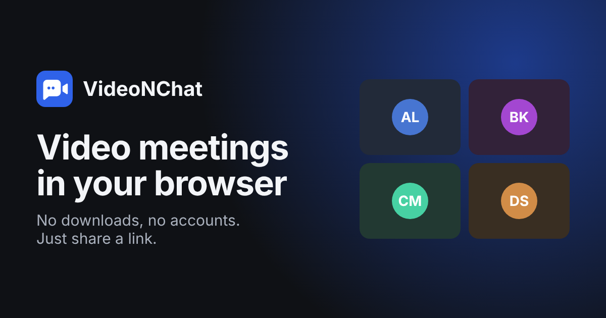

# VideoNChat

Video meetings in the browser: share a link, and talk face to face, chat,
present your screen and share files. No downloads and no accounts.



Live: <https://videocallchat-app-2bkn.onrender.com>

## Features

**In a call**

- Video and audio for up to six people, with a stage that keeps tiles as
  large as the window allows. Pin anyone to the spotlight; a shared screen
  takes it automatically.
- Screen sharing, full screen and picture-in-picture for any tile.
- A lobby to check your camera and microphone (with a level meter), pick
  devices and join with either one off. Every camera or microphone error
  is explained in plain words.
- Chat with links, a typing indicator and history for late joiners, plus
  files sent straight from person to person.
- Raise your hand and send reactions.
- Noise suppression you can turn off, and background blur where the
  browser can do it on the device.
- Live captions, for people who choose to caption their own speech.
- Recording on your own device, with everyone told while it lasts.
- Calls survive network drops: people reconnect into the same call
  without anyone seeing them leave. After a server restart, everyone
  rejoins by themselves.

**For the host** (whoever is first in)

- Lock the meeting so newcomers have to ask, then admit or deny them.
- Mute someone, ask them to unmute (only they can turn their mic on),
  lower their hand, or remove them.

**For everyone**

- Keyboard shortcuts (below), screen reader announcements, visible focus,
  WCAG AA contrast and reduced-motion support, checked with axe in every
  test run.
- Works on phones: 44 px touch targets, a front/back camera switch, and
  invites through the share sheet.
- Light and dark themes for the landing pages; calls stay dark.

| Shortcut | Windows and Linux | Mac, iPad |
| --- | --- | --- |
| Microphone on/off | Ctrl+D | ⌘D |
| Camera on/off | Ctrl+E | ⌘E |
| Open or close chat | Ctrl+Alt+C | ⌃⌘C |
| Open or close people | Ctrl+Alt+P | ⌃⌘P |
| Raise or lower your hand | Ctrl+Alt+H | ⌃⌘H |
| Show all shortcuts | Ctrl+/ | ⌘/ |

## Quick start

You need Node.js 22 or newer (24 is what CI and the container use).

```sh
npm ci
npm run dev
```

Then open <http://localhost:3000>, start a meeting, and open the same link
in a second tab or on another device on your network. Browsers only allow
the camera on `localhost` or over HTTPS, so for other devices use an HTTPS
tunnel (or deploy).

## Configuration

Everything is optional and set with environment variables; see
[`.env.example`](.env.example) for the details. Invalid values stop the
server at startup with a clear message.

| Variable | Default | What it does |
| --- | --- | --- |
| `PORT` | `3000` | Port to listen on (hosting platforms set it) |
| `PUBLIC_URL` | – | The app's address. Only its pages may connect, link previews get absolute image URLs, and an `https://` URL turns on HSTS |
| `TRUST_PROXY` | `0` | Proxies in front of the app (`1` on Render, Heroku, Fly.io) |
| `MAX_ROOM_SIZE` | `6` | People per meeting (everyone sends video to everyone) |
| `RECONNECT_GRACE_SECONDS` | `15` | How long a dropped connection can take to come back |
| `SHUTDOWN_GRACE_SECONDS` | `5` | How long clients get to hear about a restart |
| `STUN_URLS` | Google's public STUN | STUN servers, comma-separated |
| `TURN_URLS`, `TURN_SECRET` | – | A TURN server using shared-secret credentials (e.g. coturn's `use-auth-secret`) |
| `TURN_TTL_SECONDS` | `21600` | How long TURN credentials last |
| `ICE_SERVERS` | – | Extra ICE servers as JSON, e.g. a TURN provider's static credentials |
| `LOG_LEVEL` | `info` | `debug`, `info`, `warn`, `error` or `silent` |
| `METRICS_TOKEN` | – | Turns on `/metrics` for a scraper that sends it as a Bearer token |

**Set up TURN for real meetings.** Without it, people behind strict
firewalls or some mobile networks can't connect to each other.

## Deploying

**Render.** [`render.yaml`](render.yaml) describes the service: create it
in the dashboard with *New → Blueprint*, then fill in `PUBLIC_URL` and the
TURN settings. Use a paid instance: free ones sleep, which makes the first
visitor wait and drops calls.

**Anywhere with containers.**

```sh
docker build -t videonchat .
docker run -p 3000:3000 -e PUBLIC_URL=https://meet.example.com videonchat
```

The image runs as an unprivileged user and has a health check. Put it
behind something that terminates HTTPS and supports WebSockets.

**Operating it**

- `GET /healthz` reports status, uptime, connections, rooms and
  participants, for health checks and uptime monitors.
- `GET /metrics` (with `METRICS_TOKEN`) gives Prometheus metrics: rooms,
  participants, joins by result, time to first video, TURN use, ICE
  failures, client errors and CSP violations.
- Logs are JSON lines on stdout, without names, chat or meeting IDs.
  Browsers report uncaught errors and CSP violations to the server, and
  those reports are logged the same way.
- On `SIGTERM` clients are told the server is restarting and reconnect by
  themselves; calls keep flowing in the meantime.

## How it works

```
 Browser A ◄──── WebRTC (audio, video, screen, files) ────► Browser B
     │                                                          │
     └──── Socket.IO: joining, chat, signalling ──► Node.js ◄───┘
```

- **Media goes peer to peer** in a full mesh: every participant connects
  to every other with one `RTCPeerConnection`. That keeps the server tiny
  and the media private, and it's why meetings are capped at six.
- **The server** (Express and Socket.IO) serves the pages, keeps the rooms
  in memory, relays WebRTC signalling and chat, and enforces the rules:
  it assigns IDs, validates and rate-limits every message, and decides
  who is host. The protocol is in [`docs/protocol.md`](docs/protocol.md).
- **The client** is plain ES modules with no build step and no
  third-party code at runtime, which allows a strict Content Security
  Policy (no inline scripts or styles, nothing from other origins).

Decisions are recorded in [`docs/adr`](docs/adr).

## Privacy and security

- No accounts and nothing stored: rooms, chat and locks live in memory
  and disappear when the meeting empties (or the server restarts).
- Meeting links are random and pages are `noindex`. Hosts can lock a
  meeting and choose who comes in.
- Recordings are made and saved on the recorder's device, and everyone,
  including people in the lobby, is told while one is running.
- Files go directly between participants and are always downloaded,
  never opened in the page.
- Captions are off unless you turn them on. Some browsers (like Chrome)
  send speech to their own speech service to make them, and the settings
  say so.
- Chat is only ever shown as text. Every socket message is validated and
  rate-limited, browsers may only connect from this site's pages, and responses carry a
  strict CSP, `Permissions-Policy` and, over HTTPS, HSTS.

## Development

| Command | What it does |
| --- | --- |
| `npm run dev` | Runs the server and restarts it when server code changes |
| `npm run lint` | ESLint, Stylelint and Prettier |
| `npm run format` | Fixes formatting |
| `npm test` | Server and client unit tests (`node:test`) |
| `npm run test:coverage` | The same, failing under 80% server coverage |
| `npm run test:e2e` | Playwright end-to-end tests; set `E2E_BROWSERS=chromium,firefox,webkit` for more than Chromium |
| `npm run icons` | Rebuilds `public/icons.svg` from Lucide |
| `npm run images` | Rebuilds the PNG icons and the link-preview image |

CI runs all of these on every pull request, with the end-to-end tests in
Chromium, Firefox and WebKit, plus a dependency audit and a container
build.

```
app.js               entry point
src/server/          config, HTTP, realtime protocol, rooms, metrics
views/               the HTML pages
public/js/           the client: room.js, home.js, leave.js
public/js/lib/       WebRTC mesh, media, recording, files, captions, …
public/js/ui/        tiles, chat, people, lobby, menus, …
public/js/strings.js every message the client shows, ready to translate
test/server/         protocol and HTTP tests
test/client/         unit tests for client modules
test/e2e/            Playwright tests
docs/                protocol and decision records
```

## Browser support

The latest two versions of Chrome, Edge, Firefox and Safari, on desktop
and mobile. Background blur and live captions depend on the browser, and
only show up where they work.

## Limits

- Six people per meeting, because of the mesh. Bigger meetings need a
  media server (an SFU such as LiveKit or mediasoup).
- One server instance: rooms are in memory, so a restart ends locks and
  chat history (calls reconnect). Several instances would need shared
  state, such as the Socket.IO Redis adapter.

See [`IMPLEMENTATION_PLAN.md`](IMPLEMENTATION_PLAN.md) for the full
review and roadmap behind this version.

## License

[ISC](LICENSE)
